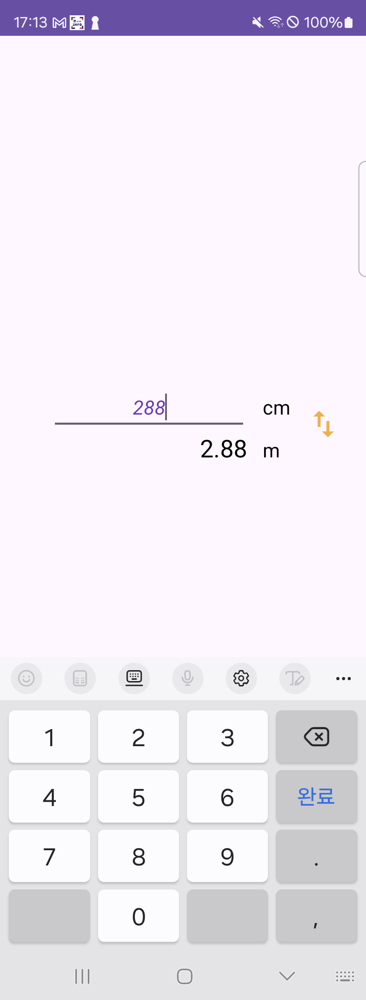

# ♻️단위 변환기 

## 📝개요
- 입력, 출력 단위 선택 할 수 있음
- 입력창에 값을 입력하면 바로 결과창에 단위가 변환된 값이 노출

## 📝구현 기능
- cm ➡ m
- 값을 입력하면 바로 변환된 값이 노출 (입력값은 자연수로 한정)
- 단위를 반대로 변경
- 단위 변환 연산

## 🛠️기능  

#### UI 

- ConstraintLayout
- EditText

#### Android 

- ViewBinding
- onSaveInstanceState
  - UI 상태 저장
  - 활동이 정지 되기 시작하면 인스턴스 상태 번들에  상태정보를 저장할 수 있도록 시스템이 onSaveInstanceState() 메서드 호출
  - 활동이 추가적인 인스턴스 상태정보를 저장하려면 onSaveInstanceState()를 재정의하고, 활동이 예상치 못하게 소멸될 경우 저장되는 Bundle 객체에 키-값 쌍을 추가해야 한다.
 
## 📸미리보기

 

